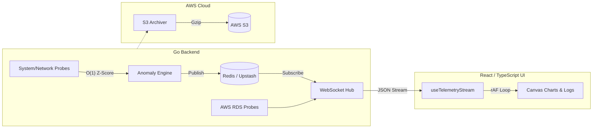

<div align="center">
  <h1>📡 TelemetryPulse</h1>
  <p><b>Enterprise Synthetic Network Observability Engine</b></p>
  <p>
    
    
    
    
    
  </p>
</div>

<br />

TelemetryPulse is a full-stack, real-time platform designed to monitor network latency, detect anomalies, and track cloud infrastructure health (AWS RDS/S3) with zero-downtime CI/CD deployment. Built for scale, it handles thousands of telemetry events per second while rendering a smooth 60 FPS dashboard.

---

## 📑 Table of Contents

- [System Architecture](#-system-architecture)
- [Key Features](#-key-features)
- [Getting Started (Simulation Mode)](#-getting-started-simulation-mode)
- [Environment Variables](#-environment-variables)
- [CI/CD Pipeline Workflow](#-cicd-pipeline-workflow)
- [License](#-license)

---

## 🏗 System Architecture

TelemetryPulse utilizes a decoupled, high-performance architecture ensuring the UI never blocks the data ingestion pipeline.



1. **Ingestion & Processing:** Go probes continuously measure network metrics and system health.
2. **Anomaly Detection:** An O(1) sliding window algorithm calculates Z-scores in real-time.
3. **Message Broker:** Results are published to Redis, acting as a high-throughput buffer.
4. **WebSocket Broadcast:** The backend hub subscribes to Redis and fans out updates to connected clients at 500ms intervals.
5. **UI Rendering:** A custom React hook decoupled from the React render cycle processes incoming frames, updating the HTML5 Canvas at 60 FPS.

---

## ✨ Key Features

* **⚡ O(1) Anomaly Detection:** Implements a highly efficient sliding window Z-score algorithm to detect network spikes and latency anomalies in real-time without computational bottleneck.
* **🚀 High-Performance Pub/Sub:** Uses Redis to buffer and broadcast thousands of telemetry events per second via WebSockets, rendering at a smooth 60 FPS on the React frontend.
* **🏭 Enterprise CI/CD Factory:** Features a strict 9-stage Jenkins pipeline that enforces code quality (ESLint for React, staticcheck for Go), executes unit tests with high coverage, and compiles production-ready binaries.
* **☁️ Automated Cloud Probing & Archival:** Includes internal probes that monitor AWS RDS cluster health and automated systems that batch and compress historical telemetry data into AWS S3 vaults on-the-fly.
* **🛡️ Graceful Degradation (Simulation Mode):** The backend is engineered to gracefully fall back to a local simulation mode (bypassing AWS credentials) for local development and offline testing.

---

## 🚀 Getting Started (Simulation Mode)

You can run TelemetryPulse locally without needing AWS credentials or a cloud Redis instance. The system will automatically fall back to Simulation Mode.

### Prerequisites
* Go 1.24+
* Node.js 18+
* Local Redis instance (running on default port `6379`)

### 1. Start the Backend

```bash
cd backend

# Build the binaries
go build -o bin/server ./cmd/telemetrypulse
go build -o bin/archiver ./cmd/archiver

# Run the server (defaults to port 8080)
./bin/server
```

### 2. Start the Frontend

```bash
cd frontend

# Install dependencies strictly
npm ci

# Start the Vite development server
npm run dev
```

Open your browser to `http://localhost:5173`. The UI will connect to the local WebSocket server and begin streaming simulated data.

---

## ⚙️ Environment Variables

Configure the system for production by setting the following environment variables. In Simulation Mode, these will fall back to sensible local defaults.

| Variable | Description | Default (Local) |
| :--- | :--- | :--- |
| **Backend** | | |
| `PORT` | HTTP server port | `8080` |
| `REDIS_URL` | Redis connection string | `redis://localhost:6379` |
| `AWS_REGION` | AWS Region for RDS and S3 | `us-east-1` |
| `AWS_ACCESS_KEY_ID` | AWS API Key (or use IAM roles) | *Empty (Sim Mode)* |
| `AWS_SECRET_ACCESS_KEY` | AWS API Secret | *Empty (Sim Mode)* |
| `RDS_CLUSTER_ID` | Enable RDS monitoring for this cluster | *Empty (Disabled)* |
| `S3_BUCKET` | Target bucket for log archives | *Empty (Disabled)* |
| **Frontend** | | |
| `VITE_WS_URL` | WebSocket endpoint URL | `ws://localhost:8080/ws` |

---

## 🛠 CI/CD Pipeline Workflow

TelemetryPulse utilizes a hardened `Jenkinsfile` for continuous integration and delivery. The 9-stage automated pipeline ensures that only high-quality, tested code reaches production:

1. **Checkout:** Pulls the latest source from version control.
2. **Go: Lint:** Runs `staticcheck` to enforce Go idioms and catch bugs early.
3. **Go: Test:** Executes the full backend test suite with the race detector enabled and generates coverage reports.
4. **Go: Build:** Compiles optimized, trimmed production binaries (`server` and `archiver`).
5. **React: Install:** Performs a clean, reproducible installation of frontend dependencies via `npm ci`.
6. **React: Lint:** Runs ESLint with zero-tolerance for warnings (`--max-warnings 0`).
7. **React: Build:** Type-checks (`tsc -b`) and bundles the React application using Vite.
8. **Health Check:** An automated smoke test that spins up the compiled backend binary locally, polls the `/health` endpoint, and asserts a successful `HTTP 200 OK` response before proceeding.
9. **Archive:** Stashes the compiled binaries, test coverage reports, and frontend production bundle as Jenkins artifacts for deployment.

---

## 📄 License

This project is licensed under the MIT License. See the [LICENSE](LICENSE) file for details.
